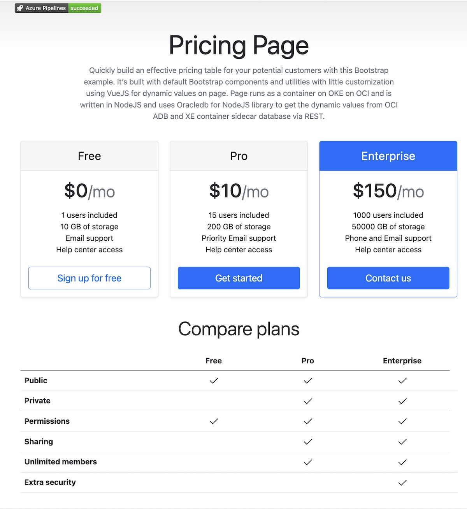

# Build and deploy a microservices NodeJS application to OKE with Azure DevOps

This example builds and deploys a microservices application consisting of the following NodeJS microservices:
<ul>
<li><code>UI</code> single page web app with Bootstrap html and CSS and VueJS scripting under /ui</li>
<li><code>Price</code> with Autonomous Database access for the Price table and data under /price</li>
<li><code>Options</code> with XE sidecar database container for the Options table and data under /options</li>
</ul>

Build and deploy will also:
<ul>
<li>Install Oracle <code>Database Operator for Kubernetes</code> to create an ADB instance for the Price database and to get access for it using the database wallet (mutual TLS) in the Price microservice</li>
<li>Run a <code>Kubernetes job</code> as NodeJS image to create the Price ADB database table with example data</li>
<li>Create <code>Oracle XE database container</code> for the Options database to be run as a sidecar for the Options microservice with example data</li>
<li>Create <code>nginx-ingress</code> to access the application from Internet</li>
</ul>

Application looks like this:

