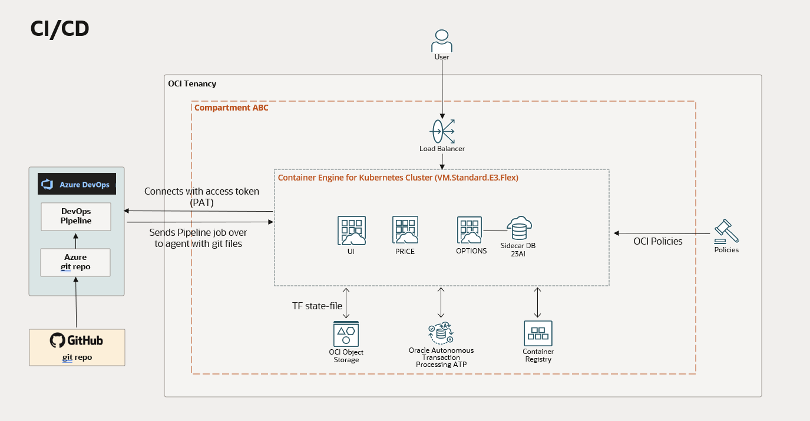
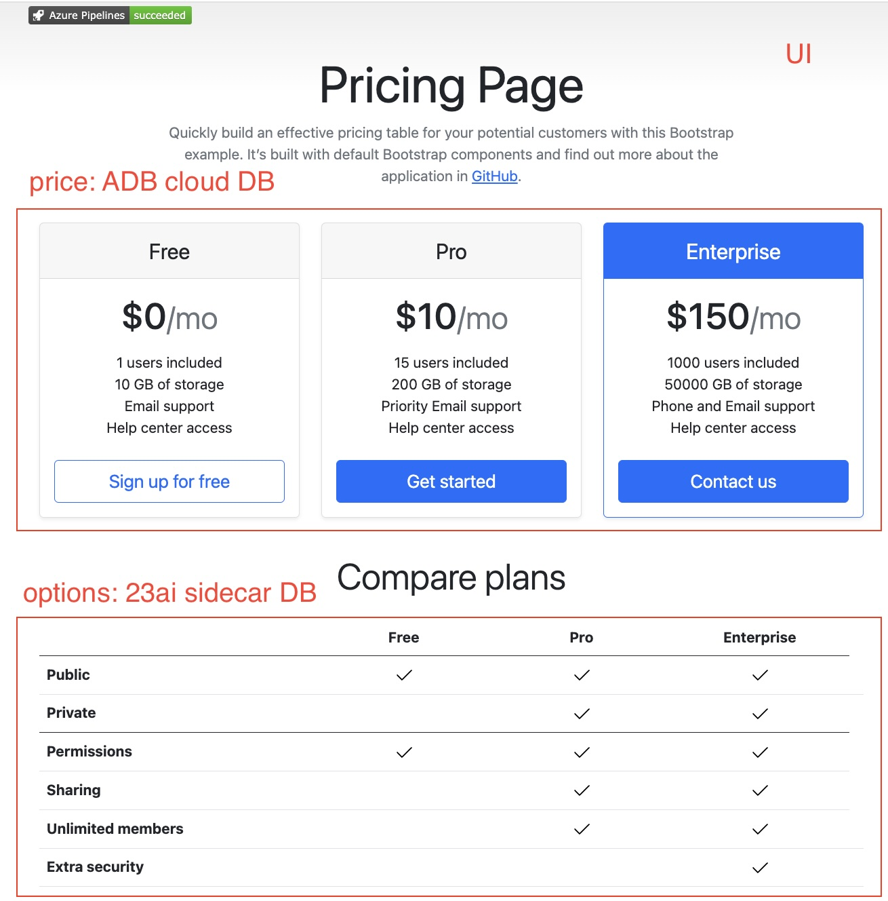

# Build and deploy a microservices NodeJS application to OKE with Azure DevOps

This Azure DevOps <a href="azure-pipelines.yml">ci/cd pipeline</a> example builds and deploys a microservices application consisting of the following NodeJS microservices:
<ul>
<li><code>UI</code> single page web app with Bootstrap html and CSS and VueJS scripting under <a href="ui"/>/ui</a></li>
<li><code>Price</code> with Autonomous Database access for the Price table and data under <a href="price/"/>/price</a></li>
<li><code>Options</code> with 23ai sidecar database container for the Options table and data under <a href="options/"/>/options</a></li>
</ul>

The ci/cd pipeline will also:
<ul>
<li>Create an ADB instance for the Price database and to get access for it using the database wallet (mutual TLS; thick driver) in the <b>Price</b> microservice</li> under <a href="adb/"/>/adb</a>. <i>The prereq is that <b>Oracle Database Operator for Kubernetes</b> is installed in the OKE cluster which can be done as cluster add-on from OCI Console</i>.</a>
<li>Run a <code>Kubernetes job</code> to create Price schemas with example data under <a href="adb-job/"/>/adb-job</a> This keeps trying (via restarts) until ADB is up and running the job can connect succesfully to it.</li>
<li>Create <code>Oracle 23ai database container</code> for the Options database to be run as a sidecar for the <b>Options</b> microservice using it via local TLS (no wallet; thin driver) under <a href="options/"/>/options</a>. 23ai database sidecar will be created using deployment <code>initContainers</code> and <a href="adb-job/"/>/adb-job</a> sidecar will create the schema and data to it. This keeps trying (via restarts) until 23ai sidecar is up and running the sidecar can connect succesfully to it.</li>
<li>Create <code>nginx-ingress</code> to access the application from Internet under <a href="ingress-nginx/"/>/ingress-nginx</a></li>
</ul>

In addition:
<ul>
<li>Azure Devops can run on a <code>self-hosted agent</code> on OCI deployed with OCI Resource Manager (terraform) from this repo: https://github.com/mikarinneoracle/Azure-DevOps-Agent-OCI-setup</li>

<li>Oracle Kubernetes Engine (OKE) cluster to host the application is created with <code>Azure Devops Terraform extension</code> from this repo: https://github.com/alcampag/oci-cn-quickstart

I made a few changes to the repo and <a href="https://github.com/mikarinneoracle/terraform-OKE-azure-devops">created a new one</a> to run it on the self-hosted agent either with 1) <a href="https://marketplace.visualstudio.com/items?itemName=ms-devlabs.custom-terraform-tasks">Azure Devops Terraform extension</a> (see the next bullet how to use it) or 2) with plain terraform in a pipeline script:
<ol type="1">
<li>In the extension Release Pipeline tasks set <code>-var tenancy_ocid="$(TENANCY)" -var compartment_ocid="$(COMPARTMENT)"</code> as Terraform <i>Additional command arguments</i> and then configure your TENANCY and COMPARTMENT values as secrets to the release pipeline variables.
</li>
<li>In the <a href="https://github.com/mikarinneoracle/terraform-OKE-azure-devops/blob/main/azure-pipelines.yml#L24">azure-pipelines.yaml</a> pass the your TENANCY and COMPARTMENT vars to the terraform command on the script and then configure these values as secrets to the pipeline variables.

Also, add the Terraform statefile PAR to the pipeline variables as it is used to configure the remote statifile for the Terraform to run <a href="https://github.com/mikarinneoracle/terraform-OKE-azure-devops/blob/main/azure-pipelines.yml#L18">with sed</a> for the <a href="https://github.com/mikarinneoracle/terraform-OKE-azure-devops/blob/main/agent-terraform-pipeline/provider.tf#L13">provider.tf</a>.
</li>
</ol>

</li>
<li>Blog how to setup the Azure DevOps Terraform extension is here: https://medium.com/@mika.rinne/azure-devops-terraform-extension-just-got-support-for-oci-cc931ca070ce</li>
<li>An <code>instance-principal OCI Policy</code> is needed for OKE to manage the ADB resources including the wallet secret volume (created by the database operator) that is created manually (at the moment not part of the Terraform above). More about using the wallet with the Oracle database operator in this blog: https://medium.com/@mika.rinne/easy-oracle-autonomous-db-access-for-nodejs-with-kubernetes-operator-cf02ea7fc59a</li>
<li>Azure DevOps <code>service connections</code> for OKE and OCI Container Registry (OCIR) are created manually using this example repo: https://github.com/oracle-devrel/technology-engineering/tree/main/app-dev/devops-and-containers/devops/azure-devops-oke</li>
</ul>

Please note that I found out that the default 50MB of disk is a bit on the low side for the deployments to run smoothly with the 23ai side car, so I recommend adjusting disk to <code>200MB</code> on the worker nodes in <b>oke.yaml</b>

Application will look like this:

### Pipeline vars

Multiple vars need to be set for the pipeline to run (with example values):

<ul>
<li><b>COMPARTMENT</b>: ocid1.compartment.oc1..aaaaaaaa...qgq</li>
<li><b>K8S_CONNECTION_NAME</b>: OKE cluster Azure pipelines <b>service connection</b> name</li>
<li><b>CONTAINER_REGISTRY</b>: OCI Registry (OCIR) Azure pipelines <b>service connection</b> name</li>
<li><b>CONTAINER_REPOSITORY_23ai</b>: &lt;TENANCY_NAMESPACE&gt;/azure-test-23ai</li>
<li><b>CONTAINER_REPOSITORY_UI</b>: &lt;TENANCY_NAMESPACE&gt;/azure-test-ui</li>
<li><b>CONTAINER_REPOSITORY_PRICE</b>: &lt;TENANCY_NAMESPACE&gt;/azure-test-price</li>
<li><b>CONTAINER_REPOSITORY_OPTIONS</b>: &lt;TENANCY_NAMESPACE&gt;/azure-test-options</li>
<li><b>CONTAINER_REPOSITORY_ADB_JOB</b>: &lt;TENANCY_NAMESPACE&gt;/azure-test-adb-job</li>
<li><b>OCIR</b>: OCIR registry name e.g. <b>fra.ocir.io</b></li>
<li><b>NAMESPACE</b>: Tenancy namespace, to get it with oci cli do <b>oci os ns get</b></li>
</ul>

### Prerequisites and tips

<ul>
<li>Setup <b>instance-principal OCI policies</b> for the Azure DevOps agent and OKE. Any <code>404 error</code> is an indication that a policy is missing. Agent runs as <code>instance-principal</code>.

</li>
</li>
<li>Create OCIR repos <i>in advance</i> before running the pipeline under the <b>target compartment</b>, otherwise they will be created automatically under the tenancy root compartment which is not a good idea.</li>
<li>Install Oracle Database Operator for Kubernetes to OKE cluster as cluster add-on from OCI Console.</li>
<li>If issues creating the ingress, download the latest ingress YAML by following <a href="https://docs.oracle.com/en-us/iaas/Content/ContEng/Tasks/contengsettingupingresscontroller.htm">these instructions</a> and replace <a href="./ingress-nginx/nginx-ingress-1.12.1.yaml">nginx-ingress-1.12.1.yaml</a> YAML with it.
</ul>
